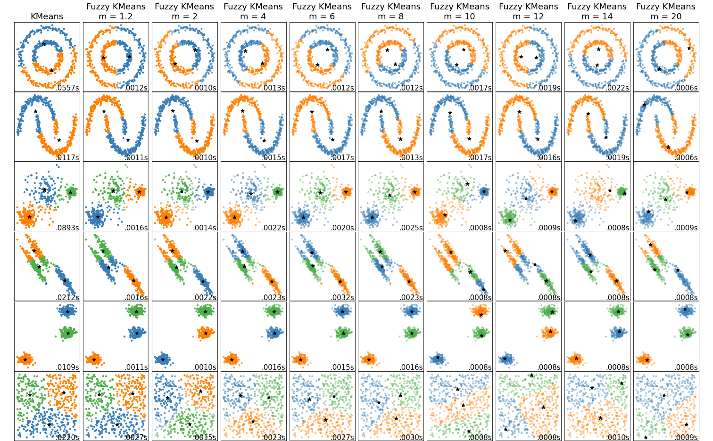

# Fuzzy K-Means
The repository includes a modular implementation for Fuzzy K-Means based on numpy with sklearn like interface.

## Algorithm Dynamics
The algorithm iteratively computes two values until convergence:
-  the centroid of the ith cluster
-  the degree to which a data point  belongs to a cluster whose centroid is ;<br> note ,

Given a fuzzification index, m, and the number of clusters, n, we compute the above values as below:
^{\frac{2}{m-1}}}%20=%20\frac{1}{\lVert%20x_i%20-%20C_j%20\rVert^{\frac{2}{m-1}}%20\cdot%20\left(\sum_{k=1}^{n}%20\left(\lVert%20x_i%20-%20C_k%20\rVert\right)^{\frac{-2}{m-1}}\right)}%20=%20\boxed{\frac{\lVert%20x_i%20-%20C_j%20\rVert^{\frac{-2}{m-1}}}{%20\sum_{k=1}^{n}%20\left(\lVert%20x_i%20-%20C_k%20\rVert\right)^{\frac{-2}{m-1}}}})

<!--$$w_{i,j} = \frac{1}{\sum_{k=1}^{n} \left(\frac{\lVert x_i - C_j \rVert}{\lVert x_i - C_k \rVert}\right)^{\frac{2}{m-1}}} = \frac{1}{\lVert x_i - C_j \rVert^{\frac{2}{m-1}} \cdot \left(\sum_{k=1}^{n} \left(\lVert x_i - C_k \rVert\right)^{\frac{-2}{m-1}}\right)} = \boxed{\frac{\lVert x_i - C_j \rVert^{\frac{-2}{m-1}}}{ \sum_{k=1}^{n} \left(\lVert x_i - C_k \rVert\right)^{\frac{-2}{m-1}}}}$$-->
As well, the cluster centroid is just a weighted mean of all the data points, having weights equal to how much it belongs to this cluster or mathematically: 


<!--$$\boxed{C_j = \frac{\sum_{i=1}^{\lvert X \rvert} w_{i,j}*x_i}{\sum_{i=1}^{\lvert X \rvert} w_{i,j}}}$$-->

Therefore, we keep iterating on computing these two values until convergence.

## FuzzyKMeans Module
Our module has a similar interface to that of normal `KMeans` provided by `sklearn`. The initializer interface accepts the parameters of `KMeans` besides:
- `m`: indicates the fuzziness index according to the above equations
- `eps`: determines the threshold value to recognize convergence.<br>The lower the value to more accurate the results would be. Its default value is `0.001`

Given that, the below code demonstrates how to use the module:
```python3
# ==============================================================================
# We assume that <X> holds the data samples, upon which we will cluster them
# ------------------------------------------------------------------------------
# We initialize the fuzziness index, m, with 2
# As well, we would like to have 3 clusters
# ==============================================================================
fkm = FuzzyKMeans(m=2, n_clusters= 3)

# ==============================================================================
# Fit the model to the training data <X>
# ==============================================================================
fkm = fkm.fit(X)

# ==============================================================================
# Get the fitting results
# 	- cluster_centers_: the centroids of the clusters
#	- labels_: the data point labels, where each belongs to the cluster hav-
#		ing the highest membership value of <w>
# 	- fmm_: the fuzzy membership value of each data point to each cluster, w
# ==============================================================================
fitted_centroids = fkm.cluster_centers_
X_labels = fkm.labels_
fmm = fkm.fmm_

# ==============================================================================
# You can as well predict, get the labels of other  data and get  the membership
# values
# ==============================================================================
new_labels = fkm.predict(new_X)
new_fmm = fkm.compute_membership(new_X)
```
## Fuzzy KMeans vs Scikit Learn KMeans
Please feel free to checkout [this notebook](https://github.com/ammarSherif/Fuzzy-K-Means/blob/main/notebooks/Fuzzy%20KMeans.ipynb) that compares between KMeans and our fuzzy implementation of it. Notice: we change the **opacity** to indicate how much a data point belongs to a cluster. Below is a the brief results at various values of `m`

## Dependencies
```
sklearn 1.0.2
numpy 1.19.5
```
## Contacts
- Github: [Fuzzy-K-Means](https://github.com/ammarSherif/Fuzzy-K-Means)
- Email: ammarsherif90 [at] gmail [dot] com